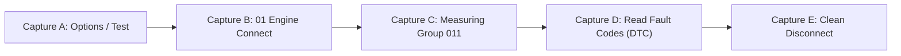

# VCDS Black-Box USB Capture Plan (B03-V2 / Ross-Tech Clone)

**Document Purpose**: Provide a deterministic, reproducible, 5-phase capture methodology to record and isolate USB communication between Ross-Tech VCDS (running on Windows) and the B03-V2 FTDI diagnostic interface (`0403:FA24`).

---

## 1. Prerequisites & Safety Guardrails

### Prerequisites
1. **Host OS**: Windows 10/11 x64.
2. **Capture Tool**: USBPcap (`C:\Program Files\USBPcap\USBPcapCMD.exe`) — verified present on this system.
3. **Diagnostic Software**: Ross-Tech VCDS (e.g., Release 22.x or 23.x installed under `C:\Ross-Tech\VCDS\`).
4. **Hardware**: B03-V2 USB diagnostic cable plugged into a USB port on the PC.
5. **Vehicle / Bench**: Connected to OBD-II port of vehicle (or 12V OBD bench power supply) with ignition **ON** (engine off).

### Safety Guardrails
> [!CAUTION]
> **READ-ONLY DISCOVERY MODE**: Under NO circumstances execute ECU coding, adaptation writing, basic settings triggering, or firmware flashing during these captures.
> All capture phases are strictly read-only diagnostics (identity verification, measuring block reading, DTC scanning).

---

## 2. Capture Workflow Architecture

To isolate command opcodes and differentiate invariant setup traffic from protocol payloads, captures MUST NOT be taken as a single monolithic recording. Instead, 5 distinct captures must be recorded:



---

## 3. Detailed Capture Steps

### Capture A: Options → Test (Interface Discovery & Loopback)
- **Objective**: Capture FTDI initialization, driver baud rate configuration, latency timer settings, adapter handshake/firmware version query, and K-Line / CAN loopback tests.
- **Physical State**: Cable connected to PC USB port. Cable may be connected to OBD-II or disconnected (note OBD status).
- **Execution**:
  1. Start capture:
     ```powershell
     .\tools\usb\capture_vcds_traffic.ps1 -CaptureName "capture_A_options_test" -DurationSeconds 30
     ```
  2. In VCDS Main Screen, click **Options**.
  3. Select **USB** radio button.
  4. Click **Test** button.
  5. Wait for the result dialog (e.g. *"Port Status: OK, Interface: Found!, Type: Ross-Tech HEX-USB+CAN"*).
  6. Click **Save**, return to main screen.
  7. Allow capture to complete and save.

---

### Capture B: Select → 01 Engine (Protocol Handshake & ECU Identity)
- **Objective**: Capture the vehicle bus wake-up sequence (5-baud init on K-Line or 500kbps CAN setup via MCP2515), ECU session establishment, and identification block exchange (KWP1281 / KWP2000 / TP2.0).
- **Physical State**: Cable connected to vehicle OBD-II port, ignition ON.
- **Execution**:
  1. Start capture:
     ```powershell
     .\tools\usb\capture_vcds_traffic.ps1 -CaptureName "capture_B_engine_connect" -DurationSeconds 35
     ```
  2. In VCDS Main Screen, click **Select** (Select Control Module).
  3. Click **01 - Engine**.
  4. Wait for VCDS to establish communication and display the ECU info (VAG Number, Component / Software version, Coding, WSC).
  5. Remain on Open Controller screen until capture finishes.

---

### Capture C: Measuring Blocks → Group 011 (Cyclic Telemetry Polling)
- **Objective**: Identify the periodic polling command structure, group parameter query opcodes, and telemetry response packing (boost pressure, RPM, duty cycle).
- **Physical State**: Controller 01 Engine is open, ignition ON.
- **Execution**:
  1. Start capture:
     ```powershell
     .\tools\usb\capture_vcds_traffic.ps1 -CaptureName "capture_C_group011_telemetry" -DurationSeconds 25
     ```
  2. In Open Controller screen, click **Meas. Blocks - 08**.
  3. In Group 1 input box, enter `011` and click **Go!**.
  4. Allow 5 to 10 rows of live data to stream in.
  5. Click **Done, Go Back**.
  6. Wait for capture completion.

---

### Capture D: Fault Codes → 02 (Diagnostic Trouble Code Interrogation)
- **Objective**: Capture DTC request opcodes, fault byte response stream, freeze-frame sub-blocks, and empty fault handling.
- **Physical State**: Controller 01 Engine is open.
- **Execution**:
  1. Start capture:
     ```powershell
     .\tools\usb\capture_vcds_traffic.ps1 -CaptureName "capture_D_dtc_read" -DurationSeconds 25
     ```
  2. Click **Fault Codes - 02**.
  3. Wait for DTC list to populate (or *"No fault code found"*).
  4. **DO NOT CLICK "Clear Codes - 05"**.
  5. Click **Done, Go Back**.
  6. Allow capture to complete.

---

### Capture E: Close Controller & Clean Disconnect
- **Objective**: Capture bus termination sequence, coprocessor sleep/idle command, and USB release sequence.
- **Execution**:
  1. Start capture:
     ```powershell
     .\tools\usb\capture_vcds_traffic.ps1 -CaptureName "capture_E_disconnect" -DurationSeconds 20
     ```
  2. Click **Close Controller, Go Back - 06**.
  3. Return to VCDS Main Screen and click **Exit**.
  4. Wait for capture completion.

---

## 4. Post-Capture Analysis Pipeline

Once `.pcap` files are recorded under `tools/usb/captures/`:

1. **Parse all captures to JSON & CSV**:
   ```powershell
   python tools/usb/parse_usb_pcap.py tools/usb/captures/capture_A_options_test.pcap --export-csv
   python tools/usb/parse_usb_pcap.py tools/usb/captures/capture_B_engine_connect.pcap --export-csv
   python tools/usb/parse_usb_pcap.py tools/usb/captures/capture_C_group011_telemetry.pcap --export-csv
   python tools/usb/parse_usb_pcap.py tools/usb/captures/capture_D_dtc_read.pcap --export-csv
   python tools/usb/parse_usb_pcap.py tools/usb/captures/capture_E_disconnect.pcap --export-csv
   ```

2. **Run Differential Analysis**:
   ```powershell
   python tools/usb/diff_usb_captures.py `
       --capture-a tools/usb/captures/capture_A_options_test.json `
       --capture-b tools/usb/captures/capture_B_engine_connect.json `
       --capture-c tools/usb/captures/capture_C_group011_telemetry.json `
       --capture-d tools/usb/captures/capture_D_dtc_read.json `
       --output docs/research/capture_diff_report.md
   ```

3. **Verify Evidence**:
   - Classify all discovered commands in `docs/research/hex_b03_reverse_engineering.md`.
   - Update `HexB03Adapter.kt` strictly with `PROVEN` opcodes.
