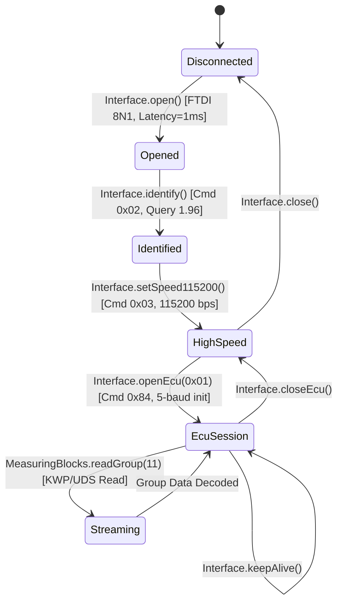

# IMPLEMENTATION SPECIFICATION: Android Transport Layer for vcds-android

## 1. Architectural Architecture & Interface Lifecycle



---

## 2. Core Protocol Operations

### 2.1 Interface.open()
- **Function:** Initializes FTDI USB serial driver for the Ross-Tech HEX adapter.
- **Input:** Android `UsbDevice` / `UsbManager` instance.
- **Output:** Connected FTDI communication channel handle.
- **USB / FTDI Wire Parameters:**
  - **Vendor ID:** `0x0403` (FTDI)
  - **Product ID:** Range `0xFA20` - `0xFA2F` (Ross-Tech HEX-USB, KEY-USB, etc.)
  - **Data Format:** 8 Data Bits, 1 Stop Bit, No Parity (`8N1`).
  - **Latency Timer:** `1 ms` (MANDATORY: FTDI default is 16 ms, which causes unacceptable round-trip delays).
  - **Read Timeout:** Non-blocking / `1 ms`.
  - **Write Timeout:** `100 ms`.
  - **Initial Baud Rate:** `9600 bps` (or `115200 bps` if adapter already configured).
  - **FIFO Flush:** Purge RX and TX buffers before first transmission.
- **Timeout:** 500 ms.
- **Retry:** Up to 3 attempts with FTDI reset (`FT_ResetDevice`).
- **Error Conditions:** No device matching VID `0x0403` and PID `0xFA20..0xFA2F`, USB permission denied, FTDI chip initialization failure.
- **State Transition:** `Disconnected` $\to$ `Opened`.
- **Evidence:**
  - Ghidra Address: `0x140111F40` (`FUN_140111f40`) and `0x140112160` (`FUN_140112160`).
  - Decompiler snippet:
    ```c
    FT_SetLatencyTimer(ftHandle, 1);
    FT_SetTimeouts(ftHandle, 1, 100);
    FT_SetDataCharacteristics(ftHandle, FT_BITS_8, FT_STOP_BITS_1, FT_PARITY_NONE);
    FT_SetBaudRate(ftHandle, 9600);
    FT_Purge(ftHandle, FT_PURGE_RX | FT_PURGE_TX);
    ```

---

### 2.2 Interface.identify()
- **Function:** Queries HEX adapter firmware version, hardware revision, and CAN capability.
- **Input:** None.
- **Output:** Firmware version (e.g., `"1.96"`), hardware model (`"HEX-USB+CAN"`, Model character `'D'`).
- **Wire Request Frame:**
  - Format: `[ Sync, Length, Opcode, Checksum ]`
  - Hex bytes: `53 04 02 55`
    - `0x53`: `'S'` Sync header
    - `0x04`: Total frame length (4 bytes)
    - `0x02`: `HEX_CMD_GET_VERSION` opcode
    - `0x55`: Checksum (`0x53 ^ 0x04 ^ 0x02 = 0x55`)
- **Wire Response Frame:**
  - Hex bytes: `4D 06 02 01 60 44 Checksum`
    - `0x4D`: `'M'` Sync header
    - `0x06`: Total response frame length (6 bytes)
    - `0x02`: Response opcode echo
    - `0x01`: Major version (`1`)
    - `0x60`: Minor version (`96` $\to$ Version 1.96)
    - `0x44`: Hardware model ASCII `'D'` (Dual-K + CAN)
    - `Checksum`: `0x4D ^ 0x06 ^ 0x02 ^ 0x01 ^ 0x60 ^ 0x44`
- **Timeout:** 750 ms (`DAT_1401F6E4C = 0x2EE`).
- **Retry:** 1 retry after 250 ms delay (`FUN_1400A143C(0xFA)`).
- **Error Conditions:** First byte not `0x4D`, length mismatch, checksum invalid, response opcode not `0x02`.
- **State Transition:** `Opened` $\to$ `Identified`.
- **Evidence:**
  - Ghidra Address: `0x14007E988` (`FUN_14007e988`).
  - Decompiler snippet:
    ```c
    local_128 = 1; local_127 = 2; // Opcode 0x02
    vcds_adapter_send_frame(param_1, &local_128);
    vcds_adapter_read_frame(param_1, &local_128);
    if (local_128 != 2) return ERROR;
    // local_127 = major, local_126 = minor, local_125 = type
    ```

---

### 2.3 Interface.setSpeed115200()
- **Function:** Switches transmission speed between Android host and adapter microcontroller to 115200 baud.
- **Input:** None (target baud rate: `115200`).
- **Output:** Boolean `true` on speed lock.
- **Wire Request Frame:**
  - Hex bytes: `53 08 03 00 C2 01 00 Checksum`
    - `0x53`: `'S'`
    - `0x08`: Total frame length (8 bytes)
    - `0x03`: `HEX_CMD_SET_COM_BAUD`
    - `0x00, 0xC2, 0x01, 0x00`: `115200` baud in 32-bit Little Endian (`0x0001C200`)
    - `Checksum`: `0x53 ^ 0x08 ^ 0x03 ^ 0x00 ^ 0xC2 ^ 0x01 ^ 0x00`
- **Handshake Sequence:**
  1. Host sends frame above at 9600 baud.
  2. Adapter returns `[ 0x4D, 0x04, 0xFE, Checksum ]` (Ack).
  3. Host calls `FT_SetBaudRate(115200)`.
  4. Adapter transmits `[ 0x4D, 0x04, 0xFD, Checksum ]` (Ready at 115200).
  5. Host sends confirmation frame: `53 04 FE Checksum`.
- **Timeout:** 750 ms per phase.
- **Error Conditions:** Missing `0xFE` or `0xFD` handshake bytes.
- **State Transition:** `Identified` $\to$ `HighSpeed`.
- **Evidence:**
  - Ghidra Address: `0x14007EC2C` (`FUN_14007ec2c`).

---

### 2.4 Interface.openEcu(byte ecuAddress)
- **Function:** Establishes diagnostic session with target ECU (e.g., `0x01` for Engine) via autonomous adapter 5-baud wake-up.
- **Input:** `ecuAddress = 0x01` (Engine).
- **Output:** Detected ECU baud rate (e.g. 9600 or 10400), Key Words `KB1`, `KB2`, sync byte `0x55`.
- **Wire Request Frame:**
  - 7-bit odd parity calculation:
    For `0x01` (binary `00000001` has 1 bit set $\to$ odd, so MSB set to 1 $\to$ `0x81`).
  - Hex bytes: `53 07 84 03 81 00 Checksum`
    - `0x53`: `'S'`
    - `0x07`: Total frame length (7 bytes)
    - `0x84`: `HEX_CMD_5BAUD_INIT` opcode
    - `0x03`: Subcommand (K-Line init)
    - `0x81`: ECU address `0x01` with odd parity
    - `0x00`: Flags
    - `Checksum`: `0x53 ^ 0x07 ^ 0x84 ^ 0x03 ^ 0x81 ^ 0x00`
- **Wire Response Frame:**
  - Hex bytes: `4D 09 84 BaudHi BaudLo KB1 KB2 55 Checksum`
    - `0x4D`: `'M'`
    - `0x09`: Total length (9 bytes)
    - `0x84`: Opcode echo
    - `BaudHi, BaudLo`: ECU communication baud rate (e.g. `0x28, 0xA0` = 10400 bps)
    - `KB1, KB2`: Key Bytes (e.g. `0x01, 0x8A` for KWP1281 or `0x08, 0x08` for KWP2000)
    - `0x55`: Sync byte confirmation
- **Timeout:** **3300 ms** (`0xCE4`). Must not be shortened, as 5-baud wake-up takes ~2.2 seconds physically on the wire.
- **Retry:** Up to 4 attempts (`R12D` loop in `HexInit`).
- **Error Conditions:** Timeout after 3.3s, response byte 0 != `0x84`, sync byte != `0x55`.
- **State Transition:** `HighSpeed` $\to$ `EcuSession`.
- **Evidence:**
  - Ghidra Address: `0x14007E3B4` (`FUN_14007e3b4`) and `0x14007E21D` (`FUN_14007e21d`).

---

### 2.5 MeasuringBlocks.readGroup(int groupNumber)
- **Function:** Reads live sensor values for a specified diagnostic group (e.g. Group 11 for Boost/MAP).
- **Input:** `groupNumber = 11` (`0x0B`).
- **Output:** Group 011 structured record (4 parsed display fields):
  - Field 1: Engine Speed (RPM)
  - Field 2: Specified Boost (mbar)
  - Field 3: Actual Boost (mbar)
  - Field 4: N75 Duty Cycle (%)
- **Wire Request Frame (KWP2000 Service 0x21):**
  - Hex bytes: `53 05 21 0B Checksum`
    - `0x53`: `'S'`
    - `0x05`: Length (5 bytes)
    - `0x21`: `ReadDataByLocalIdentifier`
    - `0x0B`: Local identifier (Group 11)
    - `Checksum`: `0x53 ^ 0x05 ^ 0x21 ^ 0x0B = 0x7C`
- **Wire Request Frame (KWP1281 Block 0x29):**
  - Hex bytes: `53 05 29 0B Checksum`
- **Wire Response Frame:**
  - KWP1281 Block Title `0xE7`:
    `4D 12 E7 [Field1: 3 bytes] [Field2: 3 bytes] [Field3: 3 bytes] [Field4: 3 bytes] Checksum`
  - KWP2000 Positive Response `0x61`:
    `4D Len 61 0B [Data bytes...] Checksum`
- **Timeout:** 750 ms (`DAT_1401F6E4C = 0x2EE`).
- **Refresh / Polling Interval:** 100 ms between queries.
- **Field Decoding Formula:**
  - Field 1 (RPM, Type 0x01): $\text{RPM} = 0.2 \times \text{ValA} \times \text{ValB}$
  - Field 2 (Spec Boost, Type 0x07): $\text{mbar} = 0.04 \times \text{ValA} \times \text{ValB}$
  - Field 3 (Actual Boost, Type 0x07): $\text{mbar} = 0.04 \times \text{ValA} \times \text{ValB}$
  - Field 4 (N75 Duty Cycle, Type 0x19): $\% = 0.005 \times \text{ValA} \times \text{ValB}$
- **Evidence:**
  - Ghidra Address: `0x14005708C` (`BlockDlg`), `0x14011FEB8` (field unpacking), `0x14005C09A` (display rows).

---

### 2.6 Interface.keepAlive()
- **Function:** Transmits tester keepalive block to prevent ECU from closing session due to inactivity.
- **Input:** None.
- **Interval:** Every 1000 ms.
- **Wire Request Frame:**
  - KWP1281: Ack Block Title `0x09` (`53 04 09 Checksum`).
  - KWP2000: TesterPresent Service `0x3E` (`53 04 3E Checksum`).
- **Timeout:** 500 ms.
- **Evidence:**
  - Ghidra Address: `0x14011A0D4` (`FUN_14011a0d4`).
