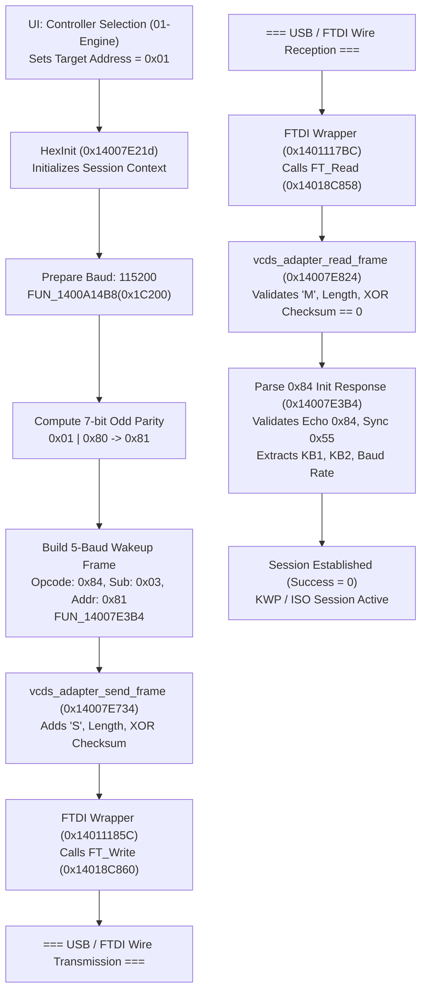

# Stage 6 & 8: ECU 01-Engine Session Flow & Call Graph

## 1. End-to-End Call Graph

---

## 2. Timing & Protocol Delegation Finding
A fundamental reverse-engineering discovery of this analysis:
- **Protocol Timing Location:** **HEX Adapter Hardware / Firmware** (NOT the host PC).
- **Physical 5-Baud Generation:** The host PC does NOT bit-bang the K-line or schedule microsecond pulse widths. Instead, VCDS issues a single high-level command frame (`Opcode 0x84, Subcommand 0x03, ECU Address 0x81`) and sets a transmission timeout of **3300 ms** (`0xCE4`).
- **Autonomous Microcontroller Execution:**
  - Microcontroller receives `[ 0x53, 0x07, 0x84, 0x03, 0x81, 0x00, Checksum ]`.
  - Drives K-line at 5 baud (200 ms bit times).
  - Waits for ECU sync byte `0x55`.
  - Measures bit times and sync pulse to calculate ECU baud rate.
  - Reads Key Words `KB1` and `KB2`.
  - Transmits inverted `KB2` within W4 timing window.
  - Returns result frame: `[ 0x4D, 0x09, 0x84, BaudHi, BaudLo, KB1, KB2, 0x55, Checksum ]`.

---

## 3. Disassembled Function Addresses
- **Controller Address Global:** `DAT_1401F6818` (uint32: `0x01` for Engine)
- **`HexInit`:** `0x14007E21D`
- **`HC::Init5Baud`:** `0x14007E3B4`
- **`vcds_adapter_send_frame`:** `0x14007E734`
- **`vcds_adapter_read_frame`:** `0x14007E824`
- **`FT_Write` pointer:** `0x14018C860`
- **`FT_Read` pointer:** `0x14018C858`
- **`FT_SetTimeouts` pointer:** `0x14018C848`
- **`FT_SetLatencyTimer` pointer:** `0x14018C878`
